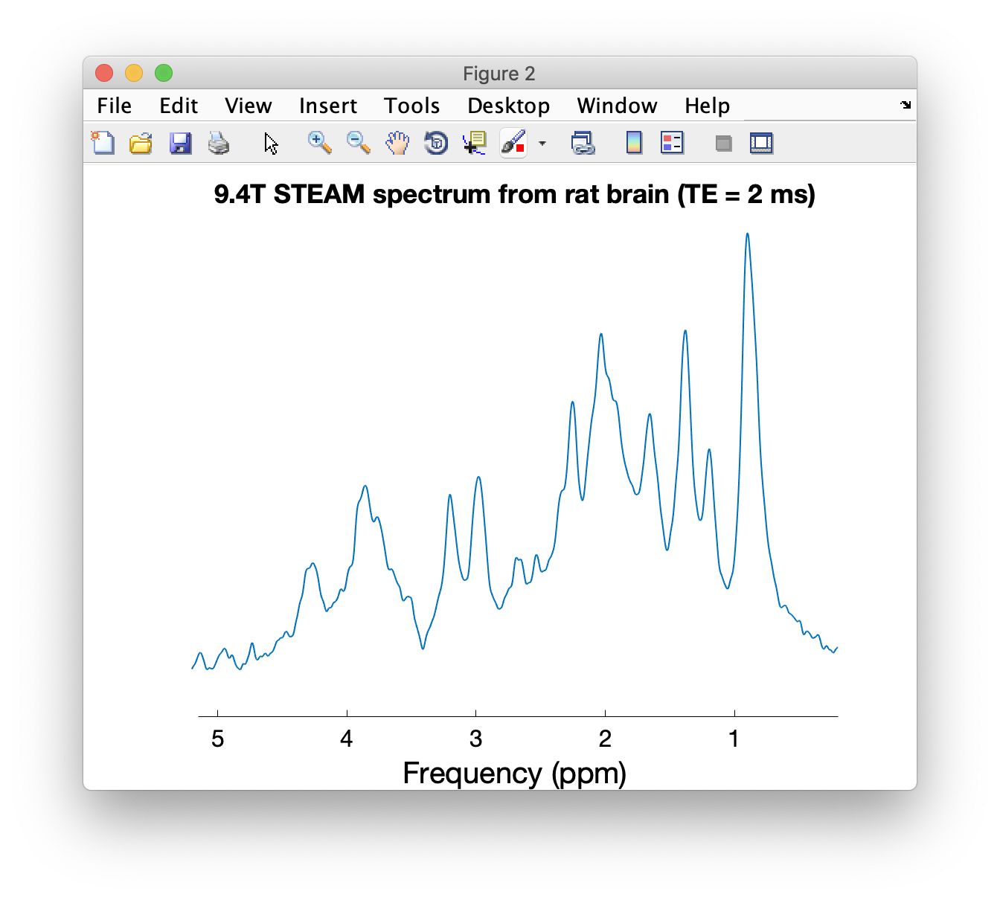

# Macromolecule data collection

This repository contains a number of pre-processed macromolecule (metabolite-nulled) spectra in Varian format (sometimes converted from Siemens format), acquired at different field strengths from different mammals, including human. These data are represented in Figure 1 of the recently published consensus on macromolecule acquisition and handling.


(adapted from: C Cudalbu, KL Behar, PK Bhattacharyya, W Bogner, T Borbath, RA de Graaf, R Gruetter, A Henning, C Juchem, R Kreis, P Lee, H Lei, M Marjanska, R Mekle, S Murali-Manohar, M Považan, V Rackayova, AM Wright, D Simicic, J Slotboom, Z Starčuk, J Starčukova, BJ Soher, I Tkáč, S Williams, M Wilson, L Xin, V Mlynárik. Contribution of macromolecules to brain 1H MR spectra: Experts' consensus recommendations. NMR Biomed (2020, in revision))

MM data have been acquired from multiple subjects, frequency-corrected, summed, and the residual water and 3.93 ppm Cr/PCr peak were removed.

The following MM spectra are included in this repository:

| Field strength (T) | Localization | TE [ms] | Type | Author |
| -----------------  | ------------ | ------- | ---- | ------ |
| 3 | STEAM | 8 | Human | Dinesh Deelchand |
| 4 | STEAM | 4 | Human | Ivan Tkáč |
| 7 | STEAM | 6 | Human | Ivan Tkáč |
| 9.4 | sLASER | 24 | Human | Anke Henning |
| 9.4 | STEAM | 2 | Rat | Ivan Tkáč |
| 9.4 | STEAM | 2 | Mouse | Ivan Tkáč |
| 9.4 | STEAM | 2 | Cat | Ivan Tkáč |
| 14.1 | SPECIAL | 2.8 | Rat | Cristina Cudalbu |

In addition, the repository contains two conventional single-subject 1H-MRS spectra from the human occipital cortex:

| Field strength (T) | Localization | TE [ms] | Type | Author |
| -----------------  | ------------ | ------- | ---- | ------ |
| 4 | STEAM | 4 | Human | Ivan Tkáč |
| 7 | STEAM | 6 | Human | Ivan Tkáč |

## Importing data

All of the above data can be imported with a Varian import function of your choice. For example, [Jamie Near's FID-A toolbox](https://github.com/CIC-methods/FID-A) includes the function [`io_loadspec_varian.m`](https://github.com/CIC-methods/FID-A/blob/master/inputOutput/io_loadspec_varian.m). The following set of code snippets can serve as a starting point:

``` matlab
filename = 'MM_database/9.4T_MM_rat_STEAM_CMRR.fid';
MM_rat = io_loadspec_varian(filename);
```

The loader will likely prompt you to provide the dimensions of the data - entering `1` for the time dimension, `2` for the average dimension, and `0` for all other dimensions will do the trick:

``` matlab
THE SIZE OF THE DATA ARRAY IS:  2048 x 1

Now please identify each of the data dimensions.  Note, if any two
data dimensions have the same array index, you will also need to
specify whether they are interleaved or not.  For example, if averages
and coils are both indexed in the 2nd dimension of the array, please
answer '2' below for both averages and coils, and then answer 'y' or 'n' to
the question about whether they are interleaved or not.

Which is the time dimension? (Usually it is '1'):  1
Which is the coils dimension? ('0' for none):  0
Which is the averages dimension? ('0' for none):  2
Which is the subspecs dimension? ('0' for none):  0
Any extra dimensions not listed above?  ('0' for none):  0
```

You can then plot the data using the FID-A `op_plotspec` function:

``` matlab
op_plotspec(MM_rat, 0.2, 5.2, 'Frequency (ppm)', '', '9.4T STEAM spectrum from rat brain (TE = 2 ms)');
```



# Acknowledgements

Data has been kindly provided by Ivan Tkáč (4 and 7T, human; 9.4T rat, mouse, cat), Anke Henning (9.4T human), Cristina Cudalbu (14.1T, rat), and Dinesh Deelchand (3T, human).

Please cite the publications mentioned below if you use data from this dataset collection:

* MM 9.4T rat - Tkáč et al., Magn Reson Med 2003; 50: 24-32
* MM 9.4T mouse - Tkáč et al., Magn Reson Med 2004; 52: 478-484
* MM and spectra 4T and 7T - Tkáč et al., Magn Reson Med 2009; 62: 868-879
* MM 14.1T rat - Cudalbu et al., J Alzheimers Dis. 2012;31 Suppl 3:S101-15. doi: 10.3233/JAD-2012-120100
