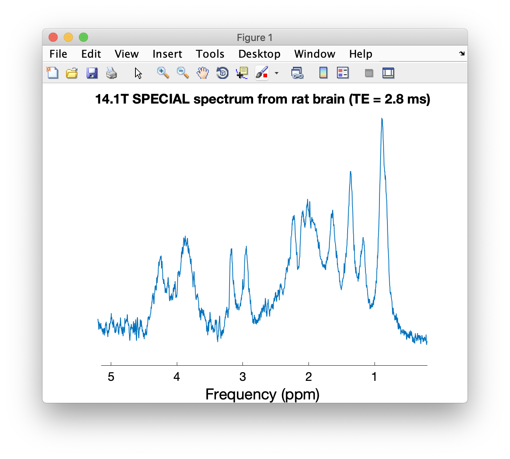
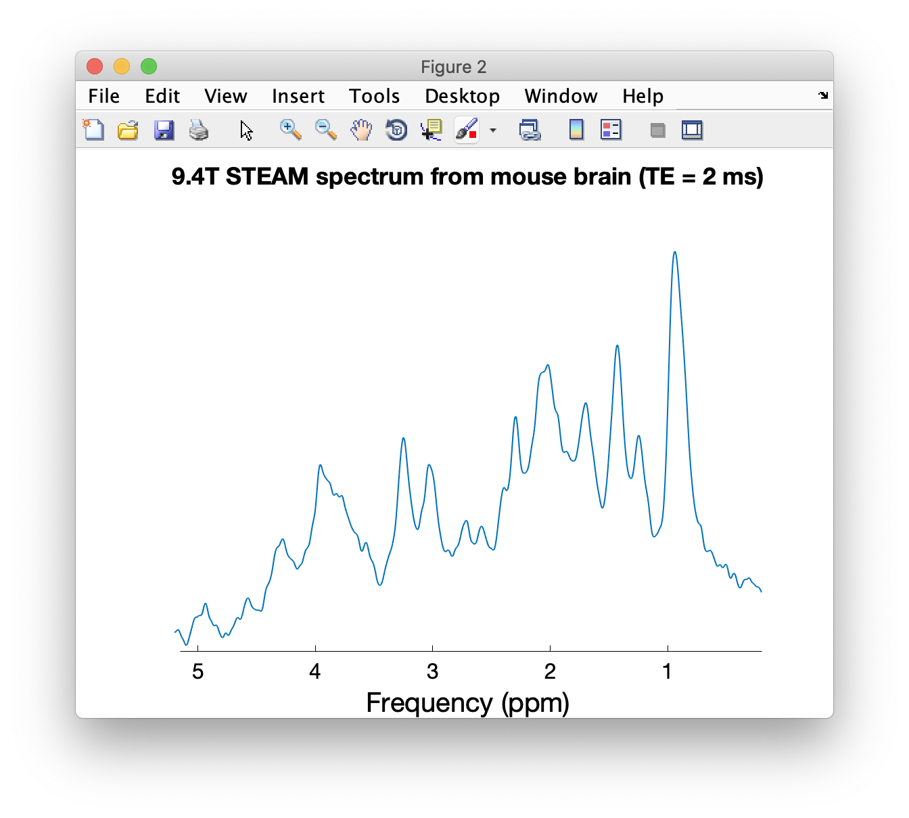
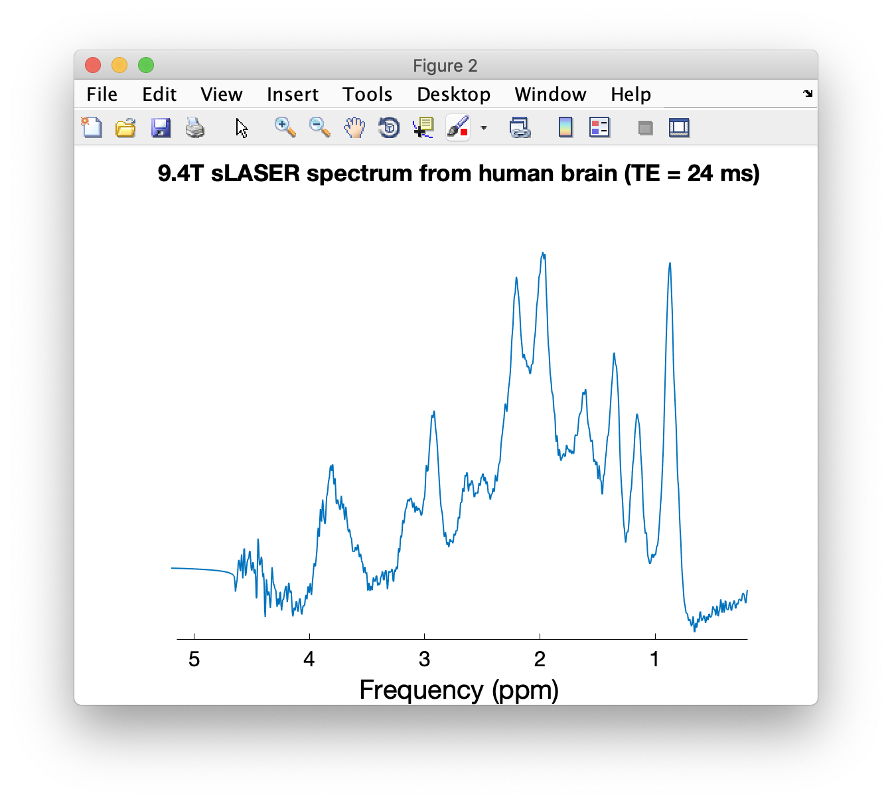
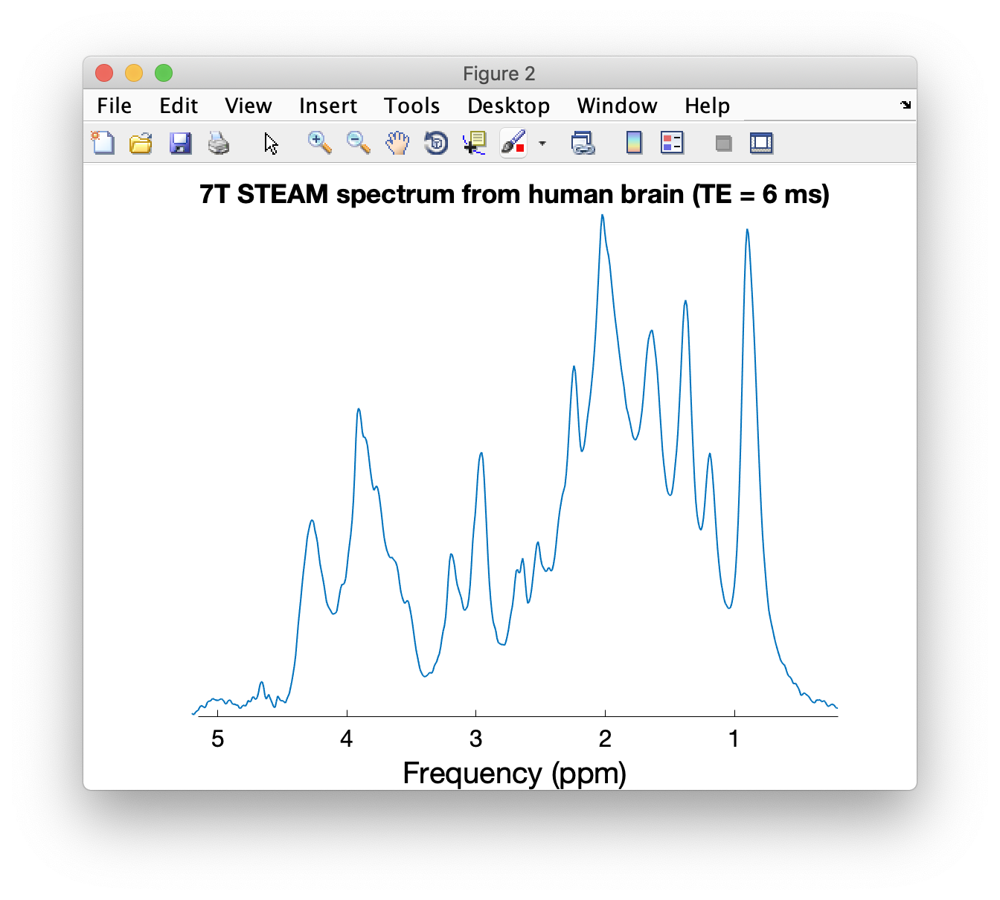
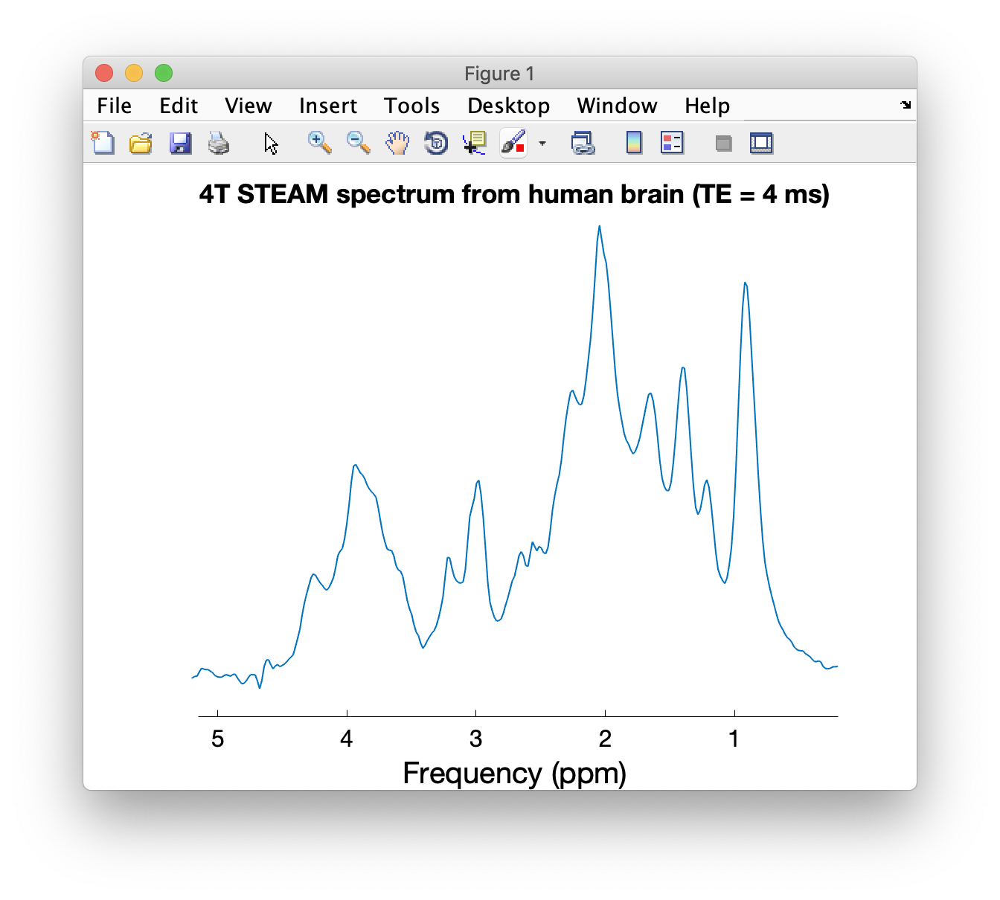
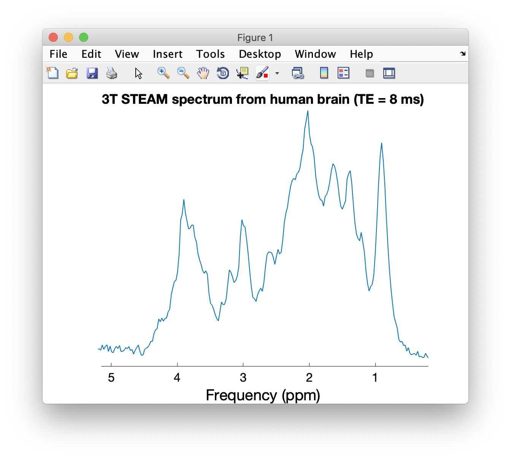
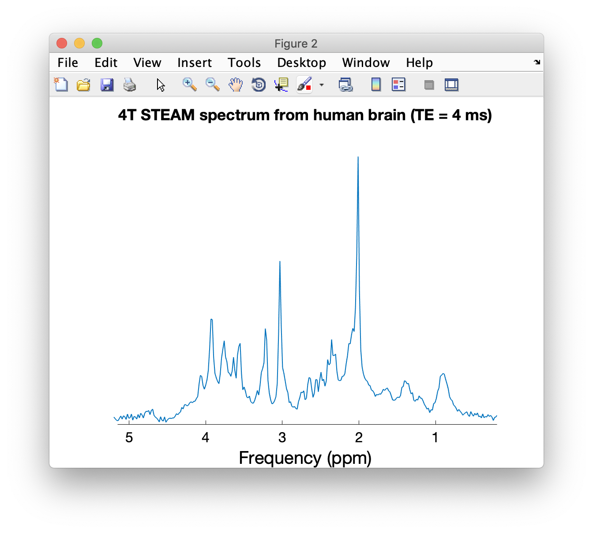
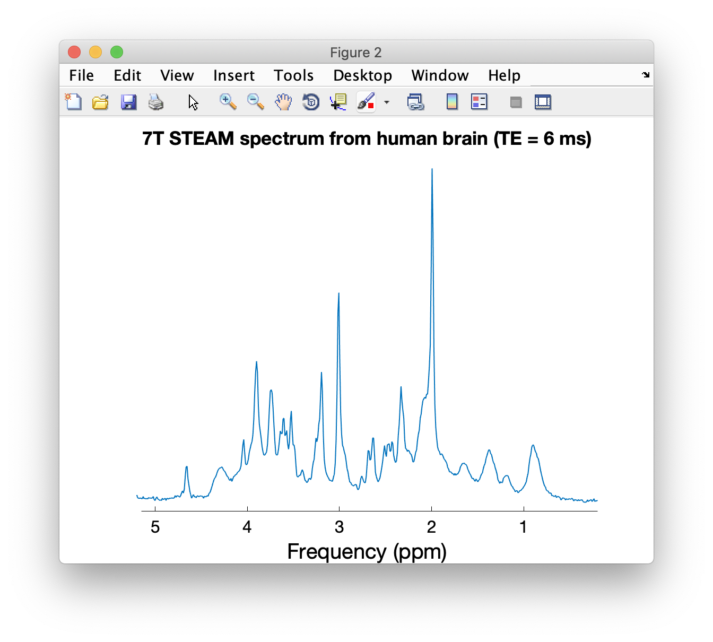

# Loading individual datasets in this repository

All of the datasets in this repository can be loaded into MATLAB with the function [`io_loadspec_varian.m`](https://github.com/CIC-methods/FID-A/blob/master/inputOutput/io_loadspec_varian.m) included in [Jamie Near's FID-A toolbox](https://github.com/CIC-methods/FID-A).

The workflow is the same for all datasets

1. Define a variable pointing to the path of the `.fid` folder:

``` matlab
filename = 'STEAM_human_spectra/4T_STEAM_TE4ms_human.fid';
```

2. Use the `io_loadspec_varian` function to load the data from the file.

``` matlab
Human4T = io_loadspec_varian(filename);
```

When prompted to provide the dimensions of the data, enter the following:
``` matlab
THE SIZE OF THE DATA ARRAY IS:  2048 x 1

Now please identify each of the data dimensions.  Note, if any two
data dimensions have the same array index, you will also need to
specify whether they are interleaved or not.  For example, if averages
and coils are both indexed in the 2nd dimension of the array, please
answer '2' below for both averages and coils, and then answer 'y' or 'n' to
the question about whether they are interleaved or not.

Which is the time dimension? (Usually it is '1'):  1
Which is the coils dimension? ('0' for none):  0
Which is the averages dimension? ('0' for none):  2
Which is the subspecs dimension? ('0' for none):  0
Any extra dimensions not listed above?  ('0' for none):  0
```

3. Display the loaded data using the `op_plotspec` function:

``` matlab
op_plotspec(Human4T, 0.2, 5.2, 'Frequency (ppm)', '', '4T STEAM spectrum from human brain (TE = 4 ms)');
```

## MM datasets

### 14.T SPECIAL rat brain (TE = 2.8 ms)

The 14.1T SPECIAL spectrum in this dataset requires an additional zero-order phase correction of -95 degrees, which we apply using the FID-A toolbox as well:
``` matlab
filename = 'MM_database/14.1T_MM_rat_SPECIAL_Lausanne.fid';
Rat14T_MM = io_loadspec_varian(filename);
Rat14T_MM = op_addphase(Rat14T_MM, -95);
op_plotspec(Rat14T_MM, 0.2, 5.2, 'Frequency (ppm)', '', '14.1T SPECIAL spectrum from rat brain (TE = 2.8 ms)');
```


### 9.4T STEAM rat brain (TE = 2 ms)

``` matlab
filename = 'MM_database/9.4T_MM_rat_STEAM_CMRR.fid';
Rat94T_MM = io_loadspec_varian(filename);
op_plotspec(Rat94T_MM, 0.2, 5.2, 'Frequency (ppm)', '', '9.4T STEAM spectrum from rat brain (TE = 2 ms)');
```


### 9.4T STEAM mouse brain (TE = 2 ms)

``` matlab
filename = 'MM_database/9.4T_MM_mouse_STEAM_CMRR.fid';
Mouse94T_MM = io_loadspec_varian(filename);
op_plotspec(Mouse94T_MM, 0.2, 5.2, 'Frequency (ppm)', '', '9.4T STEAM spectrum from mouse brain (TE = 2 ms)');
```


### 9.4T STEAM cat brain (TE = 2 ms)

``` matlab
filename = 'MM_database/9.4T_MM_cat_STEAM_CMRR.fid';
Cat94T_MM = io_loadspec_varian(filename);
op_plotspec(Cat94T_MM, 0.2, 5.2, 'Frequency (ppm)', '', '9.4T STEAM spectrum from cat brain (TE = 2 ms)');
```


### 9.4T sLASER human brain (TE = 24 ms)

``` matlab
filename = 'MM_database/9.4T_MM_human_sLASER_Tubingen.fid';
Human94T_MM = io_loadspec_varian(filename);
op_plotspec(Human94T_MM, 0.2, 5.2, 'Frequency (ppm)', '', '9.4T sLASER spectrum from human brain (TE = 24 ms)');
```


### 7T STEAM human brain (TE = 6 ms)

``` matlab
filename = 'MM_database/7T_MM_human_STEAM_CMRR.fid';
Human7T_MM = io_loadspec_varian(filename);
op_plotspec(Human7T_MM, 0.2, 5.2, 'Frequency (ppm)', '', '7T STEAM spectrum from human brain (TE = 6 ms)');
```


### 4T STEAM human brain (TE = 4 ms)

``` matlab
filename = 'MM_database/4T_MM_human_STEAM_CMRR.fid';
Human4T_MM = io_loadspec_varian(filename);
op_plotspec(Human4T_MM, 0.2, 5.2, 'Frequency (ppm)', '', '4T STEAM spectrum from human brain (TE = 4 ms)');
```


### 3T STEAM human brain (TE = 8 ms)

``` matlab
filename = 'MM_database/3T_MM_human_STEAM_CMRR.fid';
Human3T_MM = io_loadspec_varian(filename);
op_plotspec(Human3T_MM, 0.2, 5.2, 'Frequency (ppm)', '', '3T STEAM spectrum from human brain (TE = 8 ms)');
```


## 1H-MRS datasets

### 4T STEAM human brain (TE = 4 ms)

``` matlab
filename = 'STEAM_human_spectra/4T_STEAM_TE4ms_human.fid';
Human4T = io_loadspec_varian(filename);
op_plotspec(Human4T, 0.2, 5.2, 'Frequency (ppm)', '', '4T STEAM spectrum from human brain (TE = 4 ms)');
```



### 7T STEAM human brain (TE = 6 ms)

``` matlab
filename = 'STEAM_human_spectra/7T_STEAM_TE6ms_human.fid';
Human7T_1hmrs = io_loadspec_varian(filename);
op_plotspec(Human7T, 0.2, 5.2, 'Frequency (ppm)', '', '7T STEAM spectrum from human brain (TE = 6 ms)');
```


